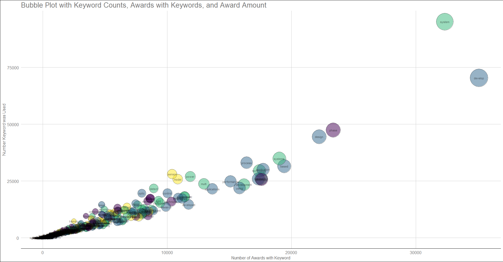

```{r setup, include=FALSE}
knitr::opts_chunk$set(echo = TRUE)
```

## Week 3


This document summarizes the main accomplishments from 02/22/21 to 02/28/21.


## Week Summary:


  Last week, we considered some of the many potential next steps for the project. As I had mentioned, I believe that all of these projects will be possible and worth doing. For this week I focused on writing code that will make these tasks possible. Here are a few of the tasks that I worked on. The scripts that I mention can be found on the github page.


### Extract Recipient Information


  I wrote a script that parses the recipient information variable that was scraped. The script is called `extract_recipient_information.R` and it writes a new table called `sbir_recipient_information.csv`. I also made some adjustments to the scraper, and the data cleaning script. I also realized that there is some additional information related to the businesses that received the rewards on the sbir website. I plan to write another scraper to collect that information. 

  As discussed, I will also be writing a scraper to collect information related to the businesses by attempting to scrape their business websites. I will provide more details on this later. However, I did want to ask a quick question about one of your ideas. You suggested that we join the sbir data with either one of a few different business databases. Please correct me if I am wrong, but it seems that one needs credentials (i.e., a paid subscription) to access those databases. If that is true, do you either have credentials or know of a publicly available database? As I said, it may be unnecessary if I can create our own data set with a scraper, but I wanted to check just in case.


### Feature Extraction


  I wrote a script in python that dummy coded the categorical variables (which will allow them to be used in statistical models. I also obtained the character and word counts for each award. This  script is called 'prepare_for_modeling_with_text_counts.Py', and creates a csv file called `prepare_for_modeling_with_text_counts.csv`. I wrote a program that calculates a number of measures related to the complexity of the text (i.e., reading levels, etc.). This script is called `create_df_textatistics.Py`, and it creates a csv called `df_textatistics.csv`. I also wrote a script to extract the number of nouns and verbs within the text, although I could easily expand it to collect other linguistic features. This script is called `create_df_propernouns_nouns_verbs.Py`, and it creates a csv called `df_propernouns_nouns_verbs.csv`.


### Keyword Extraction and Dataset


  I wrote a script (called `obtain_keywords.Py`) which extracts keywords from text. I used the program to create a list that contains the top 100 keywords from every year within the data set. I then created a list of the unique keywords, and iterated across that list to collect how often the keywords were used, how many awards used the word, and the average award amount for awards that used that keyword. This program (`create_keywords_datasets.R`) creates the `unique_keywords.csv` file, which contains the new data frame.

  I am not yet happy with this image (still a few things I need to do with it), but I thought I would share the most recent version of the bubble plot that you had requested. The code for the image can be found in the `bubble_plot_count_awards_amount.R`.




### Naive Bayes Classifier


  I worked on a number of other scripts as well. Among them is the script which contatins a classification model which is intended to use the text from the award page to predict whether it will reach phase 2 or not. The model currently is not very accurate, but it should improve as I continue to work on it. That script is titled `naive_bayes_initial_test.Py`.


### Next Steps


  For this coming week, I will continue to work on all of the tasks we have previously discussed. As always, please let me know if you have any questions or suggestions.

